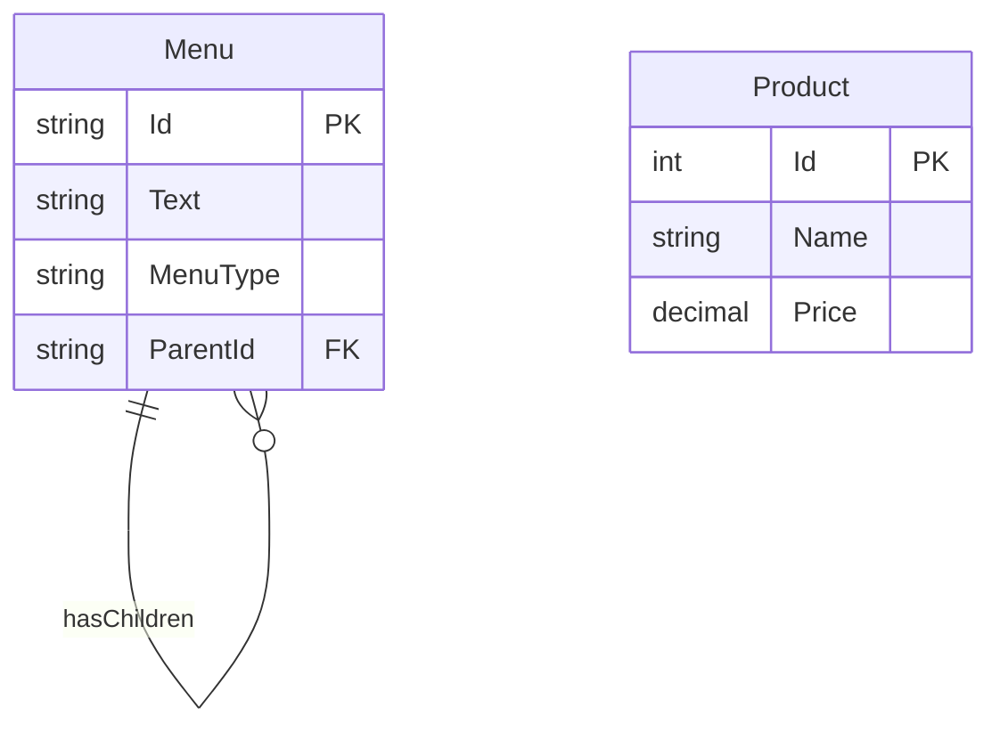

# DATMOS.Web - Kiến trúc hệ thống

## Tổng quan kiến trúc
DATMOS.Web sử dụng kiến trúc **Layered Architecture** kết hợp với **Domain-Driven Design** principles. Ứng dụng được tổ chức thành các layer rõ ràng với trách nhiệm phân tách.

## Kiến trúc layer

### 1. Presentation Layer
```
DATMOS.Web/
├── Areas/              # Logical separation by user roles
├── Controllers/        # Handle HTTP requests
├── Views/              # Razor views for UI rendering
├── Pages/              # Razor Pages for simple pages
└── ViewModels/         # Data transfer objects for views
```

### 2. Business Logic Layer
```
DATMOS.Web/
├── Services/           # Business services
│   ├── Navigation/     # Menu and navigation services
│   ├── CoursesService.cs
│   ├── ExamSubjectService.cs
│   └── LessonService.cs
└── Interfaces/         # Service contracts
```

### 3. Data Access Layer (DATMOS.Data)
```
DATMOS.Data/
├── AppDbContext.cs     # Database context
├── Migrations/         # EF Core migrations
├── MenuSeeder.cs       # Seed data
└── Program.cs          # Data layer entry point
```

### 4. Domain Layer (DATMOS.Core)
```
DATMOS.Core/
├── Entities/           # Domain entities
│   ├── Menu.cs
│   └── Product.cs
└── Interfaces/         # Domain contracts
```

## Design Patterns sử dụng

### 1. Dependency Injection (DI)
- **Mục đích**: Loose coupling, testability
- **Implementation**: ASP.NET Core built-in DI container
- **Ví dụ**:
```csharp
services.AddScoped<IMenuService, MenuService>();
services.AddScoped<ICoursesService, CoursesService>();
```

### 2. Repository Pattern
- **Mục đích**: Abstract data access logic
- **Implementation**: Entity Framework Core DbContext
- **Ví dụ**: `AppDbContext` đóng vai trò repository cho tất cả entities

### 3. Service Layer Pattern
- **Mục đích**: Encapsulate business logic
- **Implementation**: Service classes trong thư mục Services/
- **Ví dụ**: `MenuService` xử lý tất cả logic liên quan đến menu

### 4. ViewModel Pattern
- **Mục đích**: Separate view models từ domain models
- **Implementation**: ViewModel classes trong thư mục Models/ViewModels/
- **Ví dụ**: `MenuItemViewModel` cho menu rendering

### 5. Caching Pattern
- **Mục đích**: Improve performance
- **Implementation**: MemoryCache trong `MenuService`
- **Ví dụ**: Cache menu data để giảm database calls

## Flow của request

### 1. HTTP Request Flow
```
Client Request → Routing Middleware → Area Routing → Controller
    ↓
Controller → Service Layer → Repository (DbContext) → Database
    ↓
Service Layer → Process Business Logic → Return Data
    ↓
Controller → Select View → Pass ViewModel → Render HTML
    ↓
Client Response
```

### 2. Menu Request Flow (Ví dụ cụ thể)
```
User visits /Admin → MenuViewComponent.InvokeAsync("Admin")
    ↓
MenuService.GetMenuDataAsync("Admin")
    ↓
Check MemoryCache for "AdminMenu"
    ↓
If cache miss → Query database → Build hierarchy → Cache result
    ↓
Return MenuDataViewModel → ViewComponent renders menu
```

## Database Design

### 1. Entity Relationships


### 2. Migration Strategy
- **Auto-migration**: `dbContext.Database.Migrate()` trong startup
- **Version control**: Migrations được lưu trong source control
- **Seed data**: `MenuSeeder` tạo dữ liệu mẫu

## Configuration Management

### 1. Configuration Sources
```csharp
// Thứ tự ưu tiên:
// 1. appsettings.{Environment}.json
// 2. appsettings.json
// 3. Environment variables
// 4. Command-line arguments
```

### 2. Environment-specific Config
- **Development**: `appsettings.Development.json`
- **Production**: `appsettings.json` (mặc định)
- **Custom**: Có thể thêm môi trường khác

## Error Handling Architecture

### 1. Global Exception Handling
```csharp
app.UseExceptionHandler("/Home/Error"); // Production
app.UseDeveloperExceptionPage();        // Development
```

### 2. Custom Error Pages
- `/Home/Error` - Generic error page
- `/Error` - Razor Page error handler
- Status-specific pages (404, 500, etc.)

### 3. Logging Strategy
- Console logging (development)
- File logging (có thể cấu hình)
- Structured logging với Serilog (có thể tích hợp)

## Security Architecture

### 1. Authentication & Authorization
- **Current**: Basic authentication (có thể mở rộng)
- **Future**: ASP.NET Core Identity integration
- **Role-based access**: Phân quyền theo Areas

### 2. Input Validation
- **Client-side**: jQuery Validation
- **Server-side**: ModelState validation
- **Custom validation**: DataAnnotations, FluentValidation

### 3. Security Headers
```csharp
app.UseHsts();          // HTTP Strict Transport Security
app.UseHttpsRedirection(); // Force HTTPS
// X-Content-Type-Options, X-Frame-Options, etc.
```

## Performance Optimization

### 1. Caching Strategy
- **MemoryCache**: Cho dữ liệu thường xuyên đọc (menu)
- **Response caching**: Cho static content
- **Distributed caching**: Có thể mở rộng (Redis)

### 2. Database Optimization
- **Indexing**: Indexes trên các trường thường query
- **Eager loading**: `Include()` cho related data
- **Query optimization**: Select only needed columns

### 3. Frontend Optimization
- **Bundling & Minification**: CSS/JS optimization
- **Lazy loading**: Images và components
- **CDN**: Static assets từ CDN (có thể cấu hình)

## Testing Strategy

### 1. Unit Testing
- **Services**: Test business logic
- **Controllers**: Test action methods
- **ViewModels**: Test data transformations

### 2. Integration Testing
- **Database**: Test với test database
- **API endpoints**: Test HTTP responses
- **UI components**: Test Razor components

### 3. End-to-End Testing
- **Selenium**: Browser automation
- **Playwright**: Modern browser testing
- **User scenarios**: Complete user flows

## Deployment Architecture

### 1. Self-contained Deployment
```
DATMOS_Desktop.exe
├── DATMOS.Web.dll
├── DATMOS.Data.dll
├── DATMOS.Core.dll
├── wwwroot/ (static assets)
└── appsettings.json
```

### 2. Hybrid Desktop Integration
- **Web Server**: Kestrel chạy trên port 5000
- **UI Container**: WebView2 hiển thị web content
- **Process Management**: WinForms quản lý lifecycle

### 3. Database Deployment
- **Local**: PostgreSQL instance
- **Remote**: Cloud database (có thể cấu hình)
- **Migration**: Auto-migration trên startup

## Monitoring & Observability

### 1. Health Checks
```csharp
// Có thể thêm health checks endpoints
app.MapHealthChecks("/health");
```

### 2. Performance Monitoring
- **Response times**: Middleware logging
- **Database queries**: EF Core query logging
- **Memory usage**: GC monitoring

### 3. Error Tracking
- **Exception logging**: Structured error logs
- **User feedback**: Error reporting
- **Alerting**: Notification system

## Scalability Considerations

### 1. Horizontal Scaling
- **Stateless design**: Có thể scale out
- **Session management**: Distributed session (nếu cần)
- **Load balancing**: Multiple instances

### 2. Vertical Scaling
- **Resource optimization**: Memory, CPU usage
- **Database scaling**: Connection pooling, query optimization
- **Caching strategy**: Reduce database load

### 3. Microservices Readiness
- **Modular design**: Areas như microservices boundaries
- **API-first**: Có thể expose như Web API
- **Event-driven**: Có thể tích hợp message queues

---
*Document version: 1.0 - Last updated: 2025-12-23*
