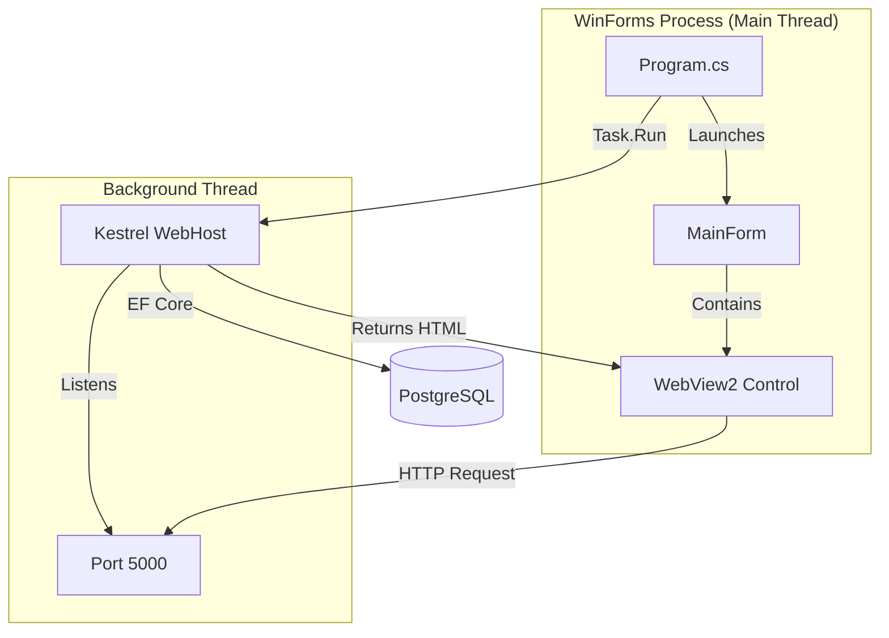

# System Patterns

## Kiến trúc hệ thống
Dự án tuân theo mô hình **Embedded Server Host** (Self-Hosted Web App):

## Các mẫu thiết kế chính (Design Patterns)

1. **Hosting Pattern (Program.cs):**
   - **Background Execution:** Web Server được khởi chạy trong `Task.Run` để tránh blocking UI Thread của WinForms (giữ cho ứng dụng luôn phản hồi).
   - **Lifecycle Management:** Sử dụng `CancellationTokenSource` để đồng bộ hóa việc tắt ứng dụng. Khi `MainForm` đóng, Token bị hủy, kích hoạt quy trình `StopAsync` của Kestrel.

2. **Web Entry Point (WebEntryPoint.cs):**
   - **Decoupled Startup:** Tách biệt logic khởi tạo `IHost` ra khỏi `Program.cs` mặc định của ASP.NET Core. Class `WebEntryPoint` đóng vai trò như một Factory tạo Host.
   - **Dynamic Configuration:** Cho phép truyền tham số (như Port) từ WinForms vào cấu hình Kestrel (`options.ListenLocalhost(port)`).

3. **UI Integration (MainForm.cs):**
   - **Async Initialization:** WebView2 được khởi tạo bất đồng bộ (`EnsureCoreWebView2Async`) để đảm bảo môi trường Edge Chromium sẵn sàng.
   - **Resilience (Retry Logic):** Vì Web Server khởi động song song, có thể xảy ra Race Condition (WebView load trước khi Server sẵn sàng). Cơ chế Retry được cài đặt trong sự kiện `NavigationCompleted` để tự động tải lại trang nếu kết nối thất bại.

4. **Dependency Injection:**
   - Sử dụng `IServiceCollection` chuẩn của ASP.NET Core.
   - `AppDbContext` được đăng ký với Scope lifetime, đảm bảo quản lý kết nối database hiệu quả.

5. **Data Migration Strategy:**
   - **Auto-Migration:** Ứng dụng tự động kiểm tra và áp dụng Migrations (`dbContext.Database.Migrate()`) khi khởi động Web Host, đảm bảo Database luôn đồng bộ với Code.